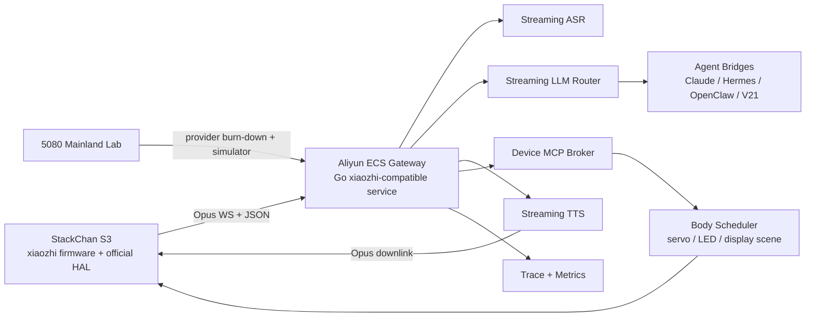

# StackChan Xiaozhi Tooling Inventory

Date: 2026-06-05

Scope: internal-only engineering inventory for building a low-latency StackChan S3 voice-dialogue hardware stack based on official M5Stack StackChan firmware and `78/xiaozhi-esp32`.

This document intentionally separates:

- Concrete tools, source repos, protocol surfaces, and development methods that are ready to use.
- Sensitive plaintext fields that must exist for deployment.
- Real secret values, which are not auto-collected into this Git workspace. The user has authorized plaintext use, but API keys, access tokens, SSH private keys, and Wi-Fi passwords should be filled in only inside an explicitly private local file or a non-public deployment secret store.

## Core Position

Do not inherit A21/X21 device firmware architecture.

Use:

- Official StackChan firmware as the hardware and display/body authority.
- `78/xiaozhi-esp32` as the audio/protocol authority.
- A hardened Go xiaozhi-compatible gateway as the service spine.
- A21 only as a tool-layer and provider-matrix reference.
- V21, Hermes, OpenClaw, Claude, and other mature agent systems as backend/tool orchestration modules, not as the realtime audio owner.

## Machines And Network

| Asset | Current Known Value | Use |
|---|---:|---|
| StackChan S3 physical device | 1 unit | Final hardware acceptance, servo/display/audio/touch/camera proof |
| Aliyun ECS | 4 core / 8 GB | Production gateway, TLS, session control, observability, provider routing |
| Local mainland lab | RTX 5080 | Provider burn-down, local model experiments, simulator, latency lab |
| Network location | Mainland China | Provider selection and routing must prioritize stable CN endpoints |
| Budget | Practically unconstrained | Prefer reliable commercial APIs and redundancy over fragile local-only paths |

Recommended network policy:

- Public: expose only `443/tcp` for TLS WebSocket/HTTPS.
- Restricted: `22/tcp` only from trusted IPs or through a jump host.
- Private/local only: Prometheus, Grafana, Redis, Postgres, admin API, MQTT broker.
- Future only: MQTT + UDP encrypted audio after WebSocket path is stable.

Production runtime policy:

- All production server components run in cloud, starting with Aliyun ECS.
- The local RTX 5080 lab is for provider burn-down, simulation, benchmark, and local model experiments only.
- The RTX 5080 lab is the preferred domestic mirror/artifact lane for large dependency, container, and model pulls.
- LAN-hosted gateways are development/test artifacts, not production routes.
- Serial is development/admin/recovery only: flashing, boot logs, NVS inspection, diagnostics, emergency config, and physical acceptance instrumentation.
- Serial must not carry normal conversation, provider bridge traffic, cloud tool calls, or user-facing command transport.

Voice-chain policy:

- Xiaozhi voice semantics are authoritative.
- Keep the official device-side microphone/speaker/Opus/listen/tts/abort behavior.
- The custom work is the cloud server: session ownership, provider routing, generation cancellation, metrics, MCP and body/display scheduling.
- Do not hand-roll a replacement audio path as the product route.
- Do not promote PCM bridge, serial audio, or LAN-only audio shortcuts beyond development diagnostics.

## Official And Reference Sources

| Source | Local Path | Role |
|---|---|---|
| M5Stack official StackChan docs | https://docs.m5stack.com/zh_CN/StackChan/ | Hardware capability baseline |
| M5Stack official StackChan repo | `/tmp/codex-stackchan-research/StackChan` | Device firmware baseline |
| Xiaozhi ESP32 repo | `/tmp/codex-stackchan-research/xiaozhi-esp32` | Audio capture/playback, Opus, WebSocket/MQTT protocol, MCP device tools |
| Xiaozhi Python server | `/tmp/codex-stackchan-research/xiaozhi-esp32-server` | Provider catalog and simple protocol reference |
| Xiaozhi Go server | `/tmp/codex-stackchan-research/xiaozhi-esp32-server-golang` | Preferred server architecture reference |
| Original stack-chan project | `/tmp/codex-stackchan-research/stack-chan` | Face/avatar/app philosophy reference |
| A21 tool-layer repo | `/Users/jiyurun/Documents/New project` | Provider adapters, benchmarks, V21 bridge docs only |
| V21 knowledge platform | `/Users/jiyurun/Documents/v21-knowledge-platform` | Existing knowledge service compatibility target |

Official StackChan firmware depends on `78/xiaozhi-esp32`:

```json
{
  "url": "https://github.com/78/xiaozhi-esp32.git",
  "path": "xiaozhi-esp32",
  "branch": "v2.2.4",
  "patch": "patches/xiaozhi-esp32.patch"
}
```

## Device Capability Baseline

StackChan S3 should be treated as an embodied robot, not a thin speaker endpoint.

Known hardware capability:

- ESP32-S3, 240 MHz dual core.
- 16 MB flash, 8 MB PSRAM.
- Wi-Fi and BLE.
- 2 inch capacitive touch display.
- Dual microphones.
- 1 W speaker.
- Camera.
- Proximity / ambient light.
- IMU.
- microSD.
- 550 mAh battery.
- Two servos for head yaw and pitch.
- RGB LEDs.
- IR, NFC, top touch.

Official HAL surfaces found in M5Stack StackChan:

| Surface | File | Notes |
|---|---|---|
| Xiaozhi app bridge | `firmware/main/hal/board/hal_bridge.cc` | Calls xiaozhi `Application::Initialize()` and `Run()` |
| Display/avatar | `firmware/main/hal/board/stackchan_display.cc` | LVGL status/avatar display |
| MCP robot tools | `firmware/main/hal/hal_mcp.cpp` | Head angle, LED, reminders |
| Servo control | `firmware/main/hal/hal_servo.cpp` | SCSCL UART1 at 1 Mbps, yaw servo id `1`, pitch id `2` |
| Top touch | `firmware/main/hal/hal_head_touch.cpp` | SI12T 3-zone touch, press/release/swipe |
| Avatar WebSocket HAL | `firmware/main/hal/hal_ws_avatar.cpp` | Binary control frames for avatar/motion/camera/audio/heartbeat |
| Camera | `firmware/main/hal/board/stackchan_camera.h` | Camera surface for device MCP and future vision |

Servo and motion limits:

| Axis | Servo ID | Official Default Zero | Hard Range | Product Natural Range |
|---|---:|---:|---:|---:|
| yaw | `1` | `460` | about `-128` to `128` degrees | `-45` to `45` degrees |
| pitch | `2` | `620` | about `3` to `87` degrees | `0` to `45` degrees |

Motion speed guidance:

- MCP `self.robot.set_head_angles` supports `yaw`, `pitch`, `speed`.
- Keep natural speed around `150`.
- Clamp service-originated speeds between `100` and `1000`.
- Add a cloud-side body scheduler so LLM/tool calls cannot spam servos.

## Xiaozhi Protocol Surfaces

### WebSocket Handshake

Device uses WebSocket first. Required or expected headers:

| Header | Meaning |
|---|---|
| `Authorization` | Device token or bearer token |
| `Protocol-Version` | Binary audio protocol version |
| `Device-Id` | Device MAC or stable device id |
| `Client-Id` | Board UUID |

Device hello:

```json
{
  "type": "hello",
  "version": 1,
  "features": {
    "mcp": true
  },
  "transport": "websocket",
  "audio_params": {
    "format": "opus",
    "sample_rate": 16000,
    "channels": 1,
    "frame_duration": 60
  }
}
```

Server hello:

```json
{
  "type": "hello",
  "transport": "websocket",
  "session_id": "server-generated-session-id",
  "audio_params": {
    "format": "opus",
    "sample_rate": 24000,
    "channels": 1,
    "frame_duration": 60
  }
}
```

### Device To Server JSON

| Message | Use |
|---|---|
| `{"type":"listen","state":"start","mode":"auto"}` | Start listening, recommended P0 mode |
| `{"type":"listen","state":"stop"}` | Stop listening and finalize turn |
| `{"type":"listen","state":"detect","text":"..."}` | Wake-word or detection event |
| `{"type":"abort"}` | User/device interrupt |
| `{"type":"mcp","payload":{...}}` | MCP JSON-RPC payload |

Listening mode decision:

- P0 product mode: `auto` / half-duplex.
- Avoid full-duplex `realtime` until AEC is proven on StackChan S3.
- Xiaozhi source shows realtime listening is only default when AEC is enabled.
- StackChan/CoreS3 path should initially assume no reliable device AEC.

### Server To Device JSON

| Message | Use |
|---|---|
| `stt` | User transcript display |
| `llm` with `emotion` | Assistant emotional state/display hint |
| `tts start` | Device enters speaking state |
| `tts sentence_start` | Text for display before or during audio |
| `tts stop` | Device returns to idle/listening |
| `mcp` | JSON-RPC tool call or response |
| `system` | Reboot or system command |
| `alert` | Alert/reminder |
| `custom` | Optional custom message if firmware enables it |

### Binary Audio

| Version | Meaning | Use |
|---|---|---|
| v1 | Raw Opus frames | P0 simplest compatible path |
| v2 | 16-byte metadata/timestamp wrapper | Needed for server AEC experiments |
| v3 | Compact wrapper | Future optimization |

Audio defaults:

- Uplink device audio: Opus, 16 kHz, mono, 60 ms frames.
- Downlink server audio: Opus, usually 24 kHz, mono, 60 ms frames.
- Keep each turn generation-bound and cancelable to avoid stale TTS audio.

### MCP

Xiaozhi MCP is JSON-RPC 2.0 embedded in `type:"mcp"` messages.

Core lifecycle:

1. Device hello advertises `features.mcp=true`.
2. Server sends MCP `initialize`.
3. Server calls `tools/list`.
4. Server calls `tools/call` for device actions.
5. Device responds with JSON-RPC result/error.

Important official StackChan MCP tools:

| Tool | Purpose | Server Policy |
|---|---|---|
| `self.robot.get_head_angles` | Read yaw/pitch | Allowed |
| `self.robot.set_head_angles` | Move head | Rate-limit and clamp |
| `self.robot.set_led_color` | RGB LED | Rate-limit, cap brightness |
| `self.robot.create_reminder` | Reminder | Allow only explicit user intent |
| `self.robot.get_reminders` | Reminder list | Allowed |
| `self.robot.stop_reminder` | Stop reminder | Allowed |

Common Xiaozhi tools from `McpServer::AddCommonTools()`:

| Tool | Purpose |
|---|---|
| `self.get_device_status` | Read device status |
| `self.audio_speaker.set_volume` | Set speaker volume |
| `self.screen.set_brightness` | Set screen brightness |
| `self.screen.set_theme` | Set screen theme |
| `self.camera.take_photo` | Take photo via camera |

User-only tools exist for system info, reboot, upgrade, screen info/snapshot/preview. Keep these behind explicit local admin control.

## Display And Avatar Control

Design principle: the device owns rendering; cloud sends semantic scene instructions.

Do not send raw UI pixels from the cloud as the main product interface.

Recommended scene DSL:

```json
{
  "type": "stackchan.scene",
  "session_id": "sid",
  "generation": 42,
  "scene": "speaking",
  "emotion": "curious",
  "caption": "我在查一下。",
  "accent": "cyan",
  "motion": {
    "preset": "nod_soft",
    "intensity": 0.35
  },
  "ttl_ms": 1800
}
```

Scene categories:

| Scene | Intended Display |
|---|---|
| `idle` | Breathing/neutral face |
| `listening` | Attentive face, optional waveform |
| `thinking` | Low-motion thinking state |
| `speaking` | Mouth animation, caption, emotion |
| `tool` | Compact progress/status card |
| `error` | Recoverable error state |
| `sleep` | Low-power/resting display |

Official `hal_ws_avatar.cpp` also exposes binary frame types:

| Frame | Use |
|---|---|
| `ControlAvatar` | Avatar state/control |
| `ControlMotion` | Motion control |
| `StartCameraStream` / `StopCameraStream` | Camera streaming |
| `HeartbeatPing` / `HeartbeatPong` | Liveness |
| `StartAudioStream` / `StopAudioStream` | Audio stream control |

Use these as implementation surfaces only after the xiaozhi main voice path is stable.

## Service Architecture

Preferred implementation language: Go.

Reason:

- Easier to keep WebSocket sessions, provider streams, cancellation, and metrics tight.
- The Go xiaozhi server already has the right shape: `ChatManager`, `ChatSession`, `ServerTransport`, `ASRManager`, `LLMManager`, `TTSManager`.
- A 4c/8G ECS is enough for gateway/control if heavy model inference stays with cloud APIs or local 5080 lab.

Recommended service modules:

| Module | Responsibility |
|---|---|
| `Transport` | Xiaozhi WebSocket, future MQTT+UDP, binary Opus framing |
| `SessionManager` | Hello/auth/session lifecycle, duplicate hello handling |
| `TurnController` | One active generation per session, cancel/barge-in, state machine |
| `AudioIngress` | Uplink Opus decode if needed, VAD, streaming ASR |
| `ASRProvider` | DashScope/Doubao/FunASR/other ASR adapters |
| `LLMRouter` | Claude/OpenAI/Qwen/DeepSeek/StepFun/Moonshot/etc. text streaming |
| `TTSProvider` | DashScope/CosyVoice/Doubao/MiniMax/IndexTTS/OpenAI TTS adapters |
| `DeviceMCP` | Device tool discovery, allowlist, tool call broker |
| `BodyScheduler` | Servo/LED/motion dedupe, clamp, rate limit |
| `SceneComposer` | Semantic display scene generation |
| `AgentBridge` | Hermes/OpenClaw/Claude/V21 integration |
| `Observability` | Trace events, latency histogram, provider error attribution |
| `Admin` | Internal status, config reload, provider matrix, no public control plane |

Mermaid overview:



## Provider And API Tooling

A21 provider code is useful as a catalog and adapter reference, not as the runtime spine.

Relevant A21 provider files:

| File | Use |
|---|---|
| `/Users/jiyurun/Documents/New project/internal/providers/dashscope_realtime.go` | DashScope realtime reference |
| `/Users/jiyurun/Documents/New project/internal/providers/doubao_realtime_asr.go` | Doubao ASR reference |
| `/Users/jiyurun/Documents/New project/internal/providers/doubao_realtime_tts_provider.go` | Doubao realtime TTS reference |
| `/Users/jiyurun/Documents/New project/internal/providers/openai_realtime.go` | OpenAI Realtime reference |
| `/Users/jiyurun/Documents/New project/internal/providers/openai_realtime_provider.go` | OpenAI realtime provider wrapper |
| `/Users/jiyurun/Documents/New project/internal/providers/cascade_voice.go` | Cascade voice architecture reference |
| `/Users/jiyurun/Documents/New project/internal/providers/textstream.go` | Text streaming contract reference |
| `/Users/jiyurun/Documents/New project/internal/providers/agent_task.go` | Agent task reference |

Relevant A21 docs:

| Doc | Use |
|---|---|
| `/Users/jiyurun/Documents/New project/docs/engineering/A21_CLOUD_VOICE_PROVIDER_MATRIX.md` | Provider profiles and selection |
| `/Users/jiyurun/Documents/New project/docs/engineering/A21_PROVIDER_BENCHMARKS.md` | Latency metric vocabulary |
| `/Users/jiyurun/Documents/New project/docs/engineering/A21_MATURE_VOICE_REUSE.md` | Explicit warning against A21 firmware inheritance |
| `/Users/jiyurun/Documents/New project/docs/engineering/V21_INTEGRATION.md` | V21 adapter boundary |
| `/Users/jiyurun/Documents/New project/docs/engineering/STACKCHAN_HARDWARE_CAPABILITY_CHARTER.md` | Hardware capability charter |
| `/Users/jiyurun/Documents/New project/docs/engineering/PROTOCOL.md` | A21 protocol lessons and guardrails |
| `/Users/jiyurun/Documents/New project/docs/engineering/LATENCY_BUDGET.md` | Latency framing |

Provider modes:

| Mode | Product Use |
|---|---|
| Cascade ASR -> streaming LLM -> streaming TTS | Default production path |
| Speech-to-speech realtime API | Experimental roleplay path only |
| Local 5080 ASR/TTS/LLM | Lab fallback and benchmark target |
| V21 professional retrieval | Professional/evidence mode only |
| Hermes/OpenClaw/Claude agent mode | Agent/tool orchestration, not audio owner |

Do not route professional/V21 retrieval through roleplay or opaque speech-to-speech mode.

## Sensitive Plaintext Registry

The tables below are intentionally plaintext-ready. Fill `Plaintext Value` in a private copy or a non-public secret file.

Recommended private locations:

- `/Users/jiyurun/Documents/a21-mainland-latency-lab/secrets`
- `/Users/jiyurun/Documents/v21-knowledge-platform/.env.stackchan.local`
- `/Users/jiyurun/Documents/v21-knowledge-platform/.env.providers.local`
- A future local file outside Git: `/Users/jiyurun/Documents/A21 air/.local/stackchan-secrets.plaintext.md`

Do not commit a file containing real API keys, bearer tokens, Wi-Fi passwords, SSH private key contents, or cloud access keys.

### ECS And Network

| Key | Plaintext Value | Source / How To Fill | Use |
|---|---|---|---|
| `STACKCHAN_ECS_PUBLIC_IP` | `TODO_PLAINTEXT` | Aliyun console | SSH, DNS, deployment |
| `STACKCHAN_ECS_DOMAIN` | `TODO_PLAINTEXT` | DNS provider | Public gateway domain |
| `STACKCHAN_ECS_PRIVATE_IP` | `TODO_PLAINTEXT` | Aliyun console | Internal service bind |
| `STACKCHAN_ECS_REGION` | `TODO_PLAINTEXT` | Aliyun console | Provider routing, logs |
| `STACKCHAN_ECS_SSH_USER` | `TODO_PLAINTEXT` | ECS image | SSH user |
| `STACKCHAN_ECS_SSH_KEY_PATH` | `TODO_PLAINTEXT` | Local key path | Deployment |
| `STACKCHAN_ECS_SSH_KEY_PASSPHRASE` | `TODO_PLAINTEXT` | User secret | Deployment only |
| `STACKCHAN_GATEWAY_PUBLIC_URL` | `wss://TODO_DOMAIN/xiaozhi/v1/ws` | DNS + TLS | Device WebSocket URL |
| `STACKCHAN_GATEWAY_ADMIN_URL` | `https://TODO_DOMAIN/internal` | Internal only | Admin/status |
| `STACKCHAN_ALLOWED_ADMIN_IPS` | `TODO_PLAINTEXT` | Home/lab IPs | Firewall |
| `STACKCHAN_TLS_CERT_PATH` | `TODO_PLAINTEXT` | ECS certbot/acme | TLS |
| `STACKCHAN_TLS_KEY_PATH` | `TODO_PLAINTEXT` | ECS certbot/acme | TLS |

### Device And Wi-Fi

| Key | Plaintext Value | Source / How To Fill | Use |
|---|---|---|---|
| `STACKCHAN_DEVICE_ID` | `TODO_PLAINTEXT` | Device MAC or assigned id | Gateway identity |
| `STACKCHAN_CLIENT_ID` | `TODO_PLAINTEXT` | Board UUID | Xiaozhi handshake |
| `STACKCHAN_AUTH_TOKEN` | `TODO_PLAINTEXT` | Generate locally | WebSocket auth |
| `STACKCHAN_WIFI_SSID` | `TODO_PLAINTEXT` | Lab Wi-Fi | Firmware/NVS |
| `STACKCHAN_WIFI_PASSWORD` | `TODO_PLAINTEXT` | Lab Wi-Fi | Firmware/NVS |
| `STACKCHAN_OTA_URL` | `TODO_PLAINTEXT` | Gateway or static release URL | OTA |
| `STACKCHAN_WEBSOCKET_URL` | `wss://TODO_DOMAIN/xiaozhi/v1/ws` | Gateway | Firmware config |

A21 names previously used for official xiaozhi-compatible firmware:

| A21 Env Name | Use |
|---|---|
| `A21_STACKCHAN_OFFICIAL_XIAOZHI_COMPATIBLE_WEBSOCKET_URL` | Device WS URL |
| `A21_STACKCHAN_OFFICIAL_XIAOZHI_COMPATIBLE_WIFI_SSID` | Wi-Fi SSID |
| `A21_STACKCHAN_OFFICIAL_XIAOZHI_COMPATIBLE_WIFI_PASSWORD` | Wi-Fi password |
| `A21_STACKCHAN_OFFICIAL_XIAOZHI_COMPATIBLE_OTA_URL` | OTA URL |
| `A21_STACKCHAN_OFFICIAL_GATEWAY_BASE_URL` | Gateway base URL |

### Provider API Keys

| Key | Plaintext Value | Existing A21 Env Names / Notes | Use |
|---|---|---|---|
| `OPENAI_API_KEY` | `TODO_PLAINTEXT` | `A21_OPENAI_API_KEY` | OpenAI Realtime/TTS/LLM |
| `OPENAI_REALTIME_MODEL` | `TODO_PLAINTEXT` | `A21_OPENAI_REALTIME_MODEL` | Realtime experiment |
| `OPENAI_REALTIME_URL` | `TODO_PLAINTEXT` | `A21_OPENAI_REALTIME_URL` | Realtime endpoint |
| `ANTHROPIC_API_KEY` | `TODO_PLAINTEXT` | add new stackchan env | Claude text/agent |
| `DASHSCOPE_API_KEY` | `TODO_PLAINTEXT` | `A21_DASHSCOPE_API_KEY` | Qwen/CosyVoice/ASR/TTS |
| `DASHSCOPE_BASE_URL` | `TODO_PLAINTEXT` | `A21_DASHSCOPE_BASE_URL` | CN routing |
| `DASHSCOPE_ASR_MODEL` | `TODO_PLAINTEXT` | `A21_DASHSCOPE_ASR_MODEL` | Streaming ASR |
| `DASHSCOPE_TTS_MODEL` | `TODO_PLAINTEXT` | `A21_DASHSCOPE_TTS_MODEL` | Streaming TTS |
| `DASHSCOPE_TTS_VOICE` | `TODO_PLAINTEXT` | `A21_DASHSCOPE_TTS_VOICE` | Voice |
| `DOUBAO_API_KEY` | `TODO_PLAINTEXT` | `A21_DOUBAO_API_KEY` | ASR/TTS/realtime |
| `DOUBAO_ACCESS_TOKEN` | `TODO_PLAINTEXT` | `A21_DOUBAO_ACCESS_TOKEN` | Alternative auth |
| `DOUBAO_APP_ID` | `TODO_PLAINTEXT` | `A21_DOUBAO_APP_ID` | Doubao realtime |
| `DOUBAO_RESOURCE_ID` | `TODO_PLAINTEXT` | `A21_DOUBAO_RESOURCE_ID` | Doubao realtime |
| `DOUBAO_SECRET_KEY` | `TODO_PLAINTEXT` | `A21_DOUBAO_SECRET_KEY` | Doubao signing if required |
| `DOUBAO_REALTIME_MODEL` | `TODO_PLAINTEXT` | `A21_DOUBAO_REALTIME_MODEL` | Realtime experiment |
| `DOUBAO_ASR_MODEL` | `TODO_PLAINTEXT` | `A21_DOUBAO_ASR_MODEL` | ASR |
| `DOUBAO_TTS_MODEL` | `TODO_PLAINTEXT` | `A21_DOUBAO_TTS_MODEL` | TTS |
| `DOUBAO_TTS_VOICE` | `TODO_PLAINTEXT` | `A21_DOUBAO_TTS_VOICE` | Voice |
| `VOLCENGINE_ARK_API_KEY` | `TODO_PLAINTEXT` | `A21_LAB_VOLCENGINE_ARK_API_KEY` | Ark LLM |
| `VOLCENGINE_ARK_BASE_URL` | `TODO_PLAINTEXT` | `A21_VOLCENGINE_ARK_BASE_URL` or lab env | Ark endpoint |
| `VOLCENGINE_ARK_MODEL` | `TODO_PLAINTEXT` | `A21_VOLCENGINE_ARK_MODEL` or lab env | Ark model |
| `MINIMAX_API_KEY` | `TODO_PLAINTEXT` | `A21_MINIMAX_API_KEY` | TTS/voice clone |
| `MINIMAX_GROUP_ID` | `TODO_PLAINTEXT` | `A21_MINIMAX_GROUP_ID` | MiniMax account |
| `MINIMAX_VOICE_ID` | `TODO_PLAINTEXT` | `A21_MINIMAX_VOICE_ID` | Voice |
| `IFLYTEK_TTS_APP_ID` | `TODO_PLAINTEXT` | `A21_IFLYTEK_TTS_APP_ID` | iFlytek TTS |
| `IFLYTEK_TTS_API_KEY` | `TODO_PLAINTEXT` | `A21_IFLYTEK_TTS_API_KEY` | iFlytek TTS |
| `IFLYTEK_TTS_API_SECRET` | `TODO_PLAINTEXT` | `A21_IFLYTEK_TTS_API_SECRET` | iFlytek TTS |
| `STEPFUN_API_KEY` | `TODO_PLAINTEXT` | `A21_LAB_STEPFUN_API_KEY` | StepFun LLM |
| `DEEPSEEK_API_KEY` | `TODO_PLAINTEXT` | `A21_LAB_DEEPSEEK_API_KEY` | DeepSeek LLM |
| `MOONSHOT_API_KEY` | `TODO_PLAINTEXT` | `A21_LAB_MOONSHOT_API_KEY` | Moonshot LLM |
| `SILICONFLOW_API_KEY` | `TODO_PLAINTEXT` | `A21_LAB_SILICONFLOW_API_KEY` | SiliconFlow LLM |

### Agent And Knowledge Backends

| Key | Plaintext Value | Existing A21 Env Names / Notes | Use |
|---|---|---|---|
| `V21_ADAPTER_URL` | `TODO_PLAINTEXT` | `A21_V21_ADAPTER_URL` | V21 adapter endpoint |
| `V21_BACKEND_URL` | `TODO_PLAINTEXT` | `A21_V21_BACKEND_URL` | V21 backend endpoint |
| `V21_ADAPTER_TOKEN` | `TODO_PLAINTEXT` | `A21_V21_ADAPTER_TOKEN` | V21 auth |
| `HERMES_AGENT_URL` | `TODO_PLAINTEXT` | `A21_HERMES_AGENT_URL` | Hermes bridge |
| `HERMES_AGENT_KEY` | `TODO_PLAINTEXT` | `A21_HERMES_AGENT_KEY` | Hermes auth |
| `OPENCLAW_WS_URL` | `TODO_PLAINTEXT` | Generated like MCP endpoint in Go server reference | OpenClaw bridge |
| `OPENCLAW_AGENT_TOKEN` | `TODO_PLAINTEXT` | Token includes user/agent claims | OpenClaw auth |
| `CLAUDE_AGENT_PROFILE` | `TODO_PLAINTEXT` | new stackchan env | Claude mode/profile |

### Local 5080 Lab

| Key | Plaintext Value | Existing A21 Env Names / Notes | Use |
|---|---|---|---|
| `LAB_5080_SSH_HOST` | `TODO_PLAINTEXT` | `A21_5080_SSH_HOST` | Remote lab execution |
| `LAB_5080_SSH_KEY` | `TODO_PLAINTEXT` | `A21_5080_SSH_KEY` | SSH key path |
| `LAB_5080_WORK_ROOT` | `TODO_PLAINTEXT` | `A21_5080_WORK_ROOT` | Work root |
| `LOCAL_OLLAMA_BASE_URL` | `TODO_PLAINTEXT` | `A21_LOCAL_OLLAMA_BASE_URL` | Local LLM experiment |
| `LOCAL_VLLM_BASE_URL` | `TODO_PLAINTEXT` | `A21_LOCAL_VLLM_BASE_URL` | Local LLM/TTS |
| `SHERPA_ONNX_MODEL_DIR` | `TODO_PLAINTEXT` | `A21_SHERPA_ONNX_MODEL_DIR` | Local ASR experiment |
| `INDEXTTS2_REPO` | `TODO_PLAINTEXT` | `A21_5080_INDEXTTS2_REPO` | Local TTS experiment |
| `INDEXTTS2_MODEL_DIR` | `TODO_PLAINTEXT` | `A21_5080_INDEXTTS2_MODEL_DIR` | Local TTS model |

## Simulation Tools

PC simulation can cover about 80-90 percent of the stack before physical gates.

Recommended simulator components:

| Simulator | Purpose |
|---|---|
| Xiaozhi client emulator | WebSocket hello/listen/abort/MCP and binary Opus loop |
| HAL emulator | Fake servo, LED, touch, display, camera responses |
| Provider latency emulator | Inject ASR/LLM/TTS first-frame and total latency |
| Waterfall trace viewer | Show speech end -> ASR -> LLM -> TTS -> downlink -> playback |
| Body scheduler test harness | Verify servo command dedupe/clamp/rate-limit |
| Scene renderer harness | Render semantic scenes on PC before flashing device |
| Full-chain mock pressure test | Run without paid providers, based on Go server mock plan |

Physical gates still required:

- Speaker audio actually plays and does not backlog.
- Microphone captures enough usable speech.
- Servo motion is safe and calibrated.
- Display scenes fit and do not flicker or block voice UX.
- Touch/camera/IMU paths do not destabilize realtime voice.
- Power/battery behavior is acceptable.

## Latency And Metrics

Use A21 metric vocabulary, but implement in the new gateway.

Required per-turn trace events:

| Metric | Meaning |
|---|---|
| `speech_end_to_final_asr_ms` | End of speech to final ASR text |
| `speech_end_to_first_llm_token_ms` | End of speech to first LLM token |
| `llm_request_to_first_token_ms` | LLM request to first token |
| `first_llm_token_to_first_tts_audio_ms` | First LLM token to first TTS audio |
| `tts_request_to_first_audio_ms` | TTS request to first audio |
| `provider_commit_to_first_audio_ms` | Provider commit to first audio |
| `gateway_downlink_first_frame_ms` | Gateway sends first downlink audio |
| `device_downlink_first_frame_ms` | Device receives first downlink audio |
| `device_playback_start_ms` | Device starts audible playback |
| `speech_end_to_first_audible_response_ms` | User-perceived latency |
| `barge_in_stop_ms` | User interrupt to stop speaking |

P0 target:

- Stable half-duplex voice loop before chasing full-duplex.
- First audible response target: around 1.0-1.5 s in normal CN network conditions.
- Barge-in stop target: under 200 ms at gateway, under 350 ms perceived if device cooperates.

## Methods To Reuse

### From Xiaozhi ESP32

- Keep official Opus audio service path.
- Keep official WebSocket hello/listen/tts/mcp semantics.
- Keep MCP JSON-RPC embedded in `type:"mcp"`.
- Keep device-side display/state transitions where possible.
- Avoid early custom PCM bridge unless debugging audio separately.

### From M5Stack StackChan

- Keep official HAL and servo/display implementation.
- Use official MCP tools for robot body control.
- Reuse official display/avatar classes.
- Add minimal scene-dispatch patches only after the main protocol is stable.

### From Go Xiaozhi Server

- Copy the architecture shape, not blindly the whole project.
- Use connection-level `ChatManager`.
- Create/reuse `ChatSession` after `hello`.
- Separate transport, session, ASR, LLM, TTS, MCP.
- Use a generation id and interrupt channel for TTS.
- Drain stale audio on interrupt.
- Pace downlink audio in one sender loop.
- Treat duplicate hello, goodbye, and reconnects explicitly.

### From A21

- Reuse provider names, env contracts, and benchmark vocabulary.
- Reuse V21 adapter boundary concepts.
- Reuse mature voice provider matrix as a shopping list.
- Do not reuse A21/X21 firmware architecture.
- Do not let A21 roleplay/professional routing leaks contaminate device protocol.

### From V21

- Keep V21 as a knowledge adapter.
- Only professional/evidence mode may call V21.
- Return evidence as structured metadata, not casual chat text.
- Do not let roleplay mode silently query V21.

### From Hermes / OpenClaw / Claude

- Treat them as agent/tool backends.
- They can generate tool intents, plans, and professional actions.
- They should not own the realtime audio session.
- Gateway remains the owner of turn lifecycle, interruption, TTS, and device MCP.

## Development Order

### Phase 0: Control And Inventory

- Create this inventory.
- Freeze decision: no A21/X21 device firmware inheritance.
- Build a private secrets file outside Git.
- Confirm ECS DNS, SSH, and firewall.
- Confirm StackChan S3 can be flashed/recovered.

### Phase 1: Protocol Simulator

- Implement PC xiaozhi WebSocket client emulator.
- Implement mock gateway hello/listen/tts/audio.
- Verify binary Opus frame send/receive.
- Add trace waterfall before real providers.

### Phase 2: Go Gateway P0

- Implement xiaozhi-compatible WebSocket endpoint.
- Implement device auth and session lifecycle.
- Implement mock ASR/LLM/TTS.
- Implement cancel/barge-in.
- Implement MCP discovery and allowlisted tool calls.

### Phase 3: Provider Burn-Down

- Test DashScope, Doubao, MiniMax, OpenAI, Claude, and other available APIs.
- Record first-token and first-audio latency.
- Choose production default and two fallbacks.
- Keep realtime speech-to-speech behind explicit experimental flag.

### Phase 4: Physical StackChan S3

- Flash official StackChan/xiaozhi-compatible firmware lane.
- Configure Wi-Fi, WebSocket URL, auth token.
- Run half-duplex voice acceptance.
- Verify display status, LED, head movement, top touch.

### Phase 5: Display And Body Polish

- Add semantic scene DSL.
- Add body scheduler.
- Add caption/emotion/motion presets.
- Add display customization without raw cloud-controlled UI.

### Phase 6: Agent And V21 Integration

- Add Claude/Hermes/OpenClaw bridges.
- Add V21 professional query adapter.
- Enforce mode boundaries.
- Add structured evidence display scene.

### Phase 7: Production Hardening

- Deploy ECS systemd service.
- Add TLS, firewall, logs, metrics, backups.
- Add provider circuit breakers.
- Add OTA discipline.
- Add disaster recovery and rollback docs.

## Acceptance Gates

| Gate | Pass Criteria |
|---|---|
| `G-PROTOCOL-WS` | Device/simulator completes hello, listen, audio, tts, abort |
| `G-AUDIO-HALF-DUPLEX` | Physical StackChan can complete 20 clean half-duplex turns |
| `G-BARGE-IN` | Interrupt stops gateway TTS generation and stale audio |
| `G-MCP-BODY` | Head/LED/display commands work with clamp/rate-limit |
| `G-DISPLAY-SCENE` | Captions/emotions render cleanly on physical screen |
| `G-PROVIDER-LATENCY` | Default provider meets latency budget over repeated tests |
| `G-V21-BOUNDARY` | Only professional mode reaches V21 |
| `G-ECS-HARDENING` | Only intended ports exposed, service survives restart |

## Immediate Next Files To Create

| File | Purpose |
|---|---|
| `.local/stackchan-secrets.plaintext.md` | Private plaintext secret values, not committed |
| `docs/architecture.md` | New project architecture explanation |
| `docs/protocol-xiaozhi.md` | Exact xiaozhi protocol contract |
| `docs/provider-matrix.md` | Provider benchmark table |
| `docs/stackchan-hardware.md` | Physical device acceptance matrix |
| `docs/latency-budget.md` | Per-stage latency budget and trace schema |
| `docs/deploy-ecs.md` | ECS deployment and firewall runbook |
