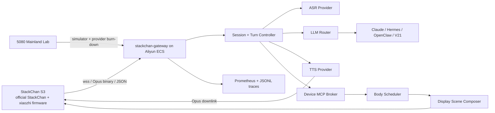
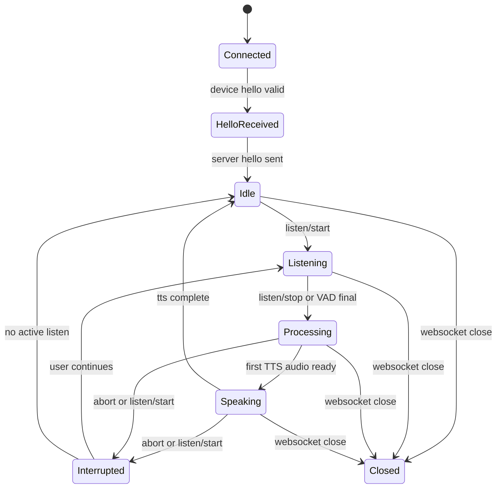

# StackChan Xiaozhi Server Implementation Plan

> **For agentic workers:** REQUIRED SUB-SKILL: Use superpowers:subagent-driven-development (recommended) or superpowers:executing-plans to implement this plan task-by-task. Steps use checkbox (`- [ ]`) syntax for tracking.

**Goal:** Build a hardened, low-latency, xiaozhi-compatible cloud gateway for one or two internal StackChan S3 devices, using official xiaozhi audio/protocol semantics while fully scheduling StackChan body/display hardware through MCP and semantic scene control.

**Architecture:** A Go service named `stackchan-gateway` owns the realtime voice session, cancellation, provider routing, device MCP calls, body scheduling, display scene generation, and observability. StackChan S3 remains an official xiaozhi/StackChan firmware device; A21 is used only for provider contracts, benchmark vocabulary, and V21 bridge lessons.

**Tech Stack:** Go 1.22+, Gorilla/WebSocket or `nhooyr.io/websocket`, Prometheus metrics, structured JSON logs, Caddy or Nginx TLS reverse proxy, systemd on Aliyun ECS, optional SQLite WAL for non-hot-path configuration and trace summaries.

---

## 0. Non-Negotiable Decisions

1. The server is a new project, not an A21/X21 service rename.
2. Device firmware compatibility target is official StackChan + `78/xiaozhi-esp32`.
3. P0 transport is WebSocket. MQTT + UDP is a future phase after physical WebSocket acceptance.
4. P0 listening mode is half-duplex / `auto`, because StackChan/CoreS3 AEC is not yet proven.
5. Realtime speech-to-speech providers are experimental roleplay paths, not the default product chain.
6. Cascade streaming ASR -> streaming LLM -> streaming TTS is the production default.
7. The gateway owns interruption and generation identity. Providers never push audio directly to the device.
8. The gateway never sends raw provider payloads, secrets, or internal traces to device firmware.
9. V21 is a professional/evidence knowledge adapter only. Roleplay and casual voice modes cannot call V21.
10. Hermes/OpenClaw/Claude-style mature agents are backend/tool orchestrators, not realtime audio session owners.
11. Production server components run in the cloud. Aliyun ECS is the first production target.
12. Serial is development/admin/recovery only and cannot become a product runtime path.
13. Xiaozhi voice semantics are authoritative. Do not hand-roll replacement device audio.

## 1. Target Runtime Topology



## 2. Service Boundary

### In Scope

- Xiaozhi-compatible WebSocket endpoint.
- Device hello/auth/session lifecycle.
- Binary Opus frame ingress and egress.
- JSON message routing: `hello`, `listen`, `abort`, `mcp`, `stt`, `llm`, `tts`, `system`, `alert`.
- Per-turn state machine and generation id.
- Streaming ASR/LLM/TTS provider contracts.
- Mock provider stack for deterministic simulator tests.
- Device MCP initialize/tools/list/tools/call broker.
- StackChan body scheduler for head/LED/display actions.
- Semantic display scene DSL.
- Provider latency measurement.
- Admin-only internal HTTP APIs.
- ECS deployment runbook.

### Out Of Scope For P0

- Multi-tenant SaaS user management.
- Public admin console.
- Full-duplex realtime conversation.
- Server AEC production mode.
- MQTT + UDP production transport.
- OTA pipeline automation.
- Camera streaming as a default hot-path feature.
- Durable long-term transcript storage.
- Heavy local model inference on ECS.
- LAN-hosted production gateway.
- Serial-backed product conversation or command path.
- Product PCM bridge or custom audio path replacing xiaozhi.

## 3. Recommended Repository Structure

Project root: `/Users/jiyurun/Documents/A21 air`

Create a new Go service under `server/`:

```text
server/
  go.mod
  go.sum
  cmd/
    stackchan-gateway/
      main.go
  internal/
    app/
      app.go
      lifecycle.go
    config/
      config.go
      env.go
      validate.go
    httpapi/
      router.go
      health.go
      admin_devices.go
      admin_sessions.go
      admin_providers.go
      errors.go
    protocol/
      xiaozhi/
        binary.go
        binary_test.go
        messages.go
        messages_test.go
        websocket.go
        websocket_test.go
    session/
      manager.go
      manager_test.go
      session.go
      session_test.go
      state.go
      turn.go
      turn_test.go
    audio/
      frame.go
      opus.go
      opus_test.go
      pacing.go
      pacing_test.go
    providers/
      contracts.go
      mock_asr.go
      mock_llm.go
      mock_tts.go
      registry.go
      registry_test.go
      dashscope/
        asr.go
        llm.go
        tts.go
      doubao/
        asr.go
        tts.go
      minimax/
        tts.go
      openai/
        realtime.go
      anthropic/
        llm.go
    mcp/
      broker.go
      broker_test.go
      jsonrpc.go
      jsonrpc_test.go
      tools.go
      allowlist.go
    stackchan/
      body_scheduler.go
      body_scheduler_test.go
      scene.go
      scene_test.go
      display.go
      motion.go
    agents/
      router.go
      claude.go
      hermes.go
      openclaw.go
      v21.go
      v21_test.go
    observability/
      logger.go
      metrics.go
      trace.go
      trace_test.go
    simulator/
      client.go
      scenario.go
      scenario_test.go
  configs/
    stackchan-gateway.example.yaml
  deploy/
    caddy/
      Caddyfile
    systemd/
      stackchan-gateway.service
    aliyun/
      firewall.md
      deploy.md
  docs/
    protocol-xiaozhi.md
    server-architecture.md
    provider-matrix.md
    latency-budget.md
    physical-acceptance.md
```

## 4. Runtime Configuration Model

Use env vars for secrets and YAML for non-secret defaults.

Primary config file:

```yaml
server:
  public_base_url: "https://stackchan.internal.example"
  listen_addr: "127.0.0.1:8080"
  websocket_path: "/xiaozhi/v1/ws"
  admin_addr: "127.0.0.1:8081"
  metrics_addr: "127.0.0.1:9090"
  shutdown_timeout_ms: 5000

devices:
  - device_id: "stackchan-s3-main"
    client_id: "stackchan-s3-main-client"
    auth_token_env: "STACKCHAN_MAIN_AUTH_TOKEN"
    default_mode: "auto"
    allow_mcp_tools:
      - "self.robot.get_head_angles"
      - "self.robot.set_head_angles"
      - "self.robot.set_led_color"
      - "self.get_device_status"
      - "self.audio_speaker.set_volume"
      - "self.screen.set_brightness"
      - "self.screen.set_theme"
      - "self.camera.take_photo"

audio:
  uplink_sample_rate_hz: 16000
  downlink_sample_rate_hz: 24000
  channels: 1
  frame_duration_ms: 60
  downlink_queue_ms: 1200
  max_turn_ms: 30000

providers:
  default_profile: "siliconflow-dashscope-voice"
  profiles:
    siliconflow-dashscope-voice:
      asr: "dashscope-asr"
      llm: "siliconflow-llm"
      tts: "dashscope-tts"
    cn-low-latency-cascade:
      asr: "mock"
      llm: "mock"
      tts: "mock"
    dashscope-cosyvoice:
      asr: "dashscope-asr"
      llm: "dashscope-llm"
      tts: "dashscope-tts"

stackchan:
  body:
    min_command_gap_ms: 160
    max_commands_per_turn: 16
    yaw_min_deg: -45
    yaw_max_deg: 45
    pitch_min_deg: 0
    pitch_max_deg: 45
    default_speed: 150
  display:
    scene_ttl_ms: 1800
    max_caption_chars: 48

observability:
  trace_jsonl_path: "./var/traces/turns.jsonl"
  redact_secrets: true
```

Required secret env vars:

| Env | Use |
|---|---|
| `STACKCHAN_MAIN_AUTH_TOKEN` | Device WebSocket auth |
| `STACKCHAN_ADMIN_TOKEN` | Internal admin bearer token |
| `DASHSCOPE_API_KEY` | DashScope ASR/LLM/TTS |
| `DOUBAO_API_KEY` | Doubao ASR/TTS/realtime experiments |
| `MINIMAX_API_KEY` | MiniMax LLM/TTS/voice experiments |
| `DEEPSEEK_API_KEY` | DeepSeek LLM fallback |
| `OPENAI_API_KEY` | OpenAI realtime or TTS experiments |
| `ANTHROPIC_API_KEY` | Claude text/agent bridge |
| `V21_ADAPTER_URL` | V21 professional adapter |
| `V21_ADAPTER_TOKEN` | V21 adapter auth |
| `HERMES_AGENT_URL` | Hermes bridge |
| `HERMES_AGENT_KEY` | Hermes bridge auth |
| `OPENCLAW_WS_URL` | OpenClaw bridge |
| `OPENCLAW_AGENT_TOKEN` | OpenClaw auth |

## 5. Public And Internal API Design

### Device WebSocket

| Method | Path | Auth | Purpose |
|---|---|---|---|
| `GET` | `/xiaozhi/v1/ws` | `Authorization` header | Xiaozhi-compatible device WebSocket |

Handshake validation:

- `Authorization` must match a configured device token.
- `Protocol-Version` must be accepted by binary framing parser.
- `Device-Id` must match or map to a configured device.
- `Client-Id` is recorded and checked for device continuity.

### Internal HTTP API

Internal endpoints bind to `127.0.0.1:8081` and are exposed only through a private tunnel or restricted reverse proxy.

| Method | Path | Purpose |
|---|---|---|
| `GET` | `/healthz` | Process health |
| `GET` | `/readyz` | Provider/config readiness |
| `GET` | `/internal/v1/devices` | List configured devices |
| `GET` | `/internal/v1/devices/{device_id}` | Device runtime state |
| `POST` | `/internal/v1/devices/{device_id}/commands` | Admin-only device command injection |
| `GET` | `/internal/v1/sessions` | Active and recent sessions |
| `GET` | `/internal/v1/sessions/{session_id}` | Session detail |
| `GET` | `/internal/v1/sessions/{session_id}/trace` | Turn trace waterfall |
| `POST` | `/internal/v1/sessions/{session_id}/abort` | Admin abort |
| `GET` | `/internal/v1/providers` | Provider profiles and health |
| `POST` | `/internal/v1/providers/{provider_id}/probe` | Run provider latency probe |
| `GET` | `/metrics` | Prometheus metrics, private only |

Standard error envelope:

```json
{
  "error": {
    "code": "VALIDATION_ERROR",
    "message": "request validation failed",
    "request_id": "req_01hxx",
    "details": [
      {
        "field": "device_id",
        "reason": "unknown device"
      }
    ]
  }
}
```

Admin command request:

```json
{
  "command_id": "cmd_01hxx",
  "kind": "mcp_tool_call",
  "tool": "self.robot.set_head_angles",
  "arguments": {
    "yaw": 15,
    "pitch": 10,
    "speed": 150
  },
  "reason": "manual_acceptance_test"
}
```

Admin command response:

```json
{
  "command_id": "cmd_01hxx",
  "accepted": true,
  "session_id": "sess_01hxx",
  "generation": 17
}
```

## 6. Xiaozhi Protocol Contract

### Device Hello

Accept:

```json
{
  "type": "hello",
  "version": 1,
  "features": {
    "mcp": true
  },
  "transport": "websocket",
  "audio_params": {
    "format": "opus",
    "sample_rate": 16000,
    "channels": 1,
    "frame_duration": 60
  }
}
```

Respond:

```json
{
  "type": "hello",
  "transport": "websocket",
  "session_id": "sess_01hxx",
  "audio_params": {
    "format": "opus",
    "sample_rate": 24000,
    "channels": 1,
    "frame_duration": 60
  }
}
```

### Listen Start

Accept:

```json
{
  "session_id": "sess_01hxx",
  "type": "listen",
  "state": "start",
  "mode": "auto"
}
```

Server action:

- Abort active speaking generation.
- Clear stale downlink audio.
- Set state to `listening`.
- Start accepting uplink audio frames.
- Emit trace event `listen_start`.

### Listen Stop

Accept:

```json
{
  "session_id": "sess_01hxx",
  "type": "listen",
  "state": "stop"
}
```

Server action:

- Finalize ASR.
- Start LLM/TTS turn if ASR text is not empty.
- Emit `tts start` before first downlink audio.
- Emit `tts stop` after all current-generation audio is sent.

### Abort

Accept:

```json
{
  "session_id": "sess_01hxx",
  "type": "abort"
}
```

Server action:

- Increment generation.
- Cancel ASR/LLM/TTS contexts.
- Drain queued downlink audio belonging to older generations.
- Send `tts stop`.
- Emit semantic display scene `listening` or `idle`.

## 7. Session State Machine



State invariants:

- A session has one current generation id.
- Any audio frame with an old generation id is dropped before device send.
- Only the downlink sender goroutine writes binary audio to the WebSocket.
- JSON control messages are serialized through the same transport lock as binary writes.
- `tts stop` is sent exactly once per generation that started speaking.
- MCP tool calls carry timeout and generation context.

## 8. Hot-Path Queue Design

Per session queues:

| Queue | Capacity | Owner | Drop Policy |
|---|---:|---|---|
| `uplink_audio_ch` | 20 frames | WebSocket reader -> ASR/VAD | Drop and count if ASR is backpressured |
| `control_ch` | 64 events | WebSocket reader/admin -> session loop | Never block WebSocket reader longer than a short timeout |
| `llm_text_ch` | 128 chunks | LLM stream -> TTS segmenter | Cancel on generation mismatch |
| `tts_audio_ch` | 20 frames | TTS provider -> downlink sender | Drop old generation on interrupt |
| `mcp_response_ch` | 32 messages | MCP broker -> session loop | Timeout caller |

Important rule:

- The WebSocket write path is single-owner. Multiple goroutines can request sends, but one sender serializes actual writes.

Downlink pacing:

- Send 60 ms Opus frames at provider-provided timing when provider streams in realtime.
- If provider produces faster than realtime, pace to avoid device playback bursts.
- If queue grows beyond `downlink_queue_ms`, cancel the generation and emit a trace error.

## 9. Provider Contracts

### ASR Contract

```go
type ASRProvider interface {
    Start(ctx context.Context, req ASRStartRequest) (ASRStream, error)
}

type ASRStream interface {
    AcceptOpus(frame AudioFrame) error
    Finish() error
    Events() <-chan ASREvent
    Close() error
}

type ASREvent struct {
    Type       string
    Text       string
    IsFinal    bool
    StartedAt  time.Time
    FinishedAt time.Time
}
```

### LLM Contract

```go
type LLMProvider interface {
    Stream(ctx context.Context, req LLMRequest) (<-chan LLMChunk, error)
}

type LLMChunk struct {
    Text       string
    Emotion    string
    ToolCalls  []ToolCall
    IsFinal    bool
    CreatedAt  time.Time
}
```

### TTS Contract

```go
type TTSProvider interface {
    Stream(ctx context.Context, req TTSRequest) (<-chan TTSFrame, error)
}

type TTSFrame struct {
    Generation int64
    Opus       []byte
    TextSpan   string
    Duration   time.Duration
    CreatedAt  time.Time
}
```

Provider policy:

- Mock providers land first and are used by all protocol tests.
- Real provider adapters are added behind the same interfaces.
- Every provider emits first-byte/first-frame timings.
- Real providers must accept context cancellation and stop network work quickly.
- Provider errors become spoken fallback only when the device is not currently interrupted.

## 10. StackChan Body And Display Scheduling

Body scheduler input:

```json
{
  "generation": 17,
  "priority": "normal",
  "motion": {
    "yaw": 15,
    "pitch": 8,
    "speed": 150
  },
  "led": {
    "r": 40,
    "g": 120,
    "b": 168
  },
  "reason": "assistant_speaking"
}
```

Scheduler rules:

- Clamp yaw to `-45..45` for normal assistant motion.
- Clamp pitch to `0..45` for normal assistant motion.
- Clamp speed to `100..1000`.
- Default speed is `150`.
- Minimum gap between servo commands is `160 ms`.
- Maximum body commands per turn is `16`.
- Drop motion commands from old generations.
- Treat admin manual commands as higher priority but still clamp.

Display scene schema:

```json
{
  "type": "stackchan.scene",
  "session_id": "sess_01hxx",
  "generation": 17,
  "scene": "speaking",
  "emotion": "curious",
  "caption": "我在查一下。",
  "accent": "cyan",
  "motion": {
    "preset": "nod_soft",
    "intensity": 0.35
  },
  "ttl_ms": 1800
}
```

Display rules:

- Cloud sends semantic scenes, not raw pixels.
- Captions are short and safe for a 2 inch display.
- Scene changes are debounced.
- Device fallback states remain valid if custom scene support is absent.
- `tts sentence_start` remains the compatibility path for text display.

## 11. Observability Plan

Every turn gets a `trace_id`, `session_id`, `device_id`, and `generation`.

Required trace events:

| Event | Required Fields |
|---|---|
| `ws_connected` | remote addr, device headers |
| `hello_received` | protocol version, audio params |
| `listen_start` | mode |
| `first_uplink_audio` | frame duration, sample rate |
| `speech_final` | ASR text length |
| `llm_request` | provider, model |
| `first_llm_token` | elapsed ms |
| `tts_request` | provider, voice |
| `first_tts_audio` | elapsed ms |
| `first_downlink_audio_sent` | elapsed ms |
| `tts_stop_sent` | generation |
| `abort_received` | old generation, new generation |
| `mcp_tool_call` | tool name, allowed, latency |
| `turn_complete` | total latency, error |

Prometheus metrics:

- `stackchan_sessions_active`
- `stackchan_turns_total`
- `stackchan_turn_errors_total`
- `stackchan_provider_requests_total`
- `stackchan_provider_first_token_seconds`
- `stackchan_provider_first_audio_seconds`
- `stackchan_speech_end_to_first_audible_seconds`
- `stackchan_barge_in_stop_seconds`
- `stackchan_downlink_queue_frames`
- `stackchan_mcp_tool_calls_total`
- `stackchan_mcp_tool_latency_seconds`

Log policy:

- JSON logs only.
- Redact tokens, API keys, Wi-Fi passwords, provider raw payloads, and V21 evidence bodies.
- Store transcript text only in explicit debug mode.
- Trace summaries may include text length and provider ids by default.

## 12. Development Milestones

### Milestone A: Skeleton And Config

Exit criteria:

- `go test ./...` passes.
- Binary starts locally with example config.
- `/healthz` and `/readyz` work.
- Config validation catches missing device token env.

### Milestone B: Xiaozhi Protocol Core

Exit criteria:

- WebSocket accepts valid device headers.
- Invalid auth is rejected.
- Device hello receives server hello.
- JSON listen/abort/mcp messages parse correctly.
- Binary Opus v1 frames are accepted and counted.

### Milestone C: Deterministic Mock Voice Loop

Exit criteria:

- Simulator completes 50 mock turns.
- Server emits `tts start`, binary audio frames, `tts sentence_start`, `tts stop`.
- Abort cancels current generation and drops stale audio.
- Trace waterfall contains all required event names.

### Milestone D: MCP And StackChan Body

Exit criteria:

- MCP initialize/tools/list handshake works.
- Allowlisted `self.robot.set_head_angles` command is sent through broker.
- Body scheduler clamps unsafe angles.
- Rate limits prevent command floods.
- Display scene compatibility path works through `tts sentence_start` or custom message.

### Milestone E: Real Provider Burn-Down

Exit criteria:

- At least two ASR providers tested.
- At least two TTS providers tested.
- At least two LLM providers tested.
- Provider report includes p50/p95 first token and first audio.
- Default profile chosen for mainland latency.

### Milestone F: ECS Deployment

Exit criteria:

- Gateway runs under systemd.
- Caddy or Nginx terminates TLS on `443`.
- Only intended ports are exposed.
- Logs and metrics are accessible privately.
- Restart does not lose ability for device to reconnect.
- This milestone is mandatory for production readiness, not an optional deployment polish step.

### Milestone G: Physical StackChan Acceptance

Exit criteria:

- Physical StackChan completes 20 half-duplex turns.
- First audible response meets target budget in normal network conditions.
- Interrupt stops stale speaking.
- Head/LED/display actions work without destabilizing audio.
- Recovery from Wi-Fi disconnect and gateway restart is verified.

## 13. Bite-Sized Implementation Tasks

### Task 1: Create Go Service Skeleton

**Files:**
- Create: `server/go.mod`
- Create: `server/cmd/stackchan-gateway/main.go`
- Create: `server/internal/app/app.go`
- Create: `server/internal/app/lifecycle.go`
- Create: `server/internal/httpapi/router.go`
- Create: `server/internal/httpapi/health.go`
- Create: `server/configs/stackchan-gateway.example.yaml`

- [ ] **Step 1: Initialize Go module**

Run:

```bash
cd /Users/jiyurun/Documents/A21\ air
mkdir -p server/cmd/stackchan-gateway server/internal/app server/internal/httpapi server/configs
cd server
go mod init stackchan-gateway
go get github.com/go-chi/chi/v5
```

Expected:

```text
go: creating new go.mod: module stackchan-gateway
```

- [ ] **Step 2: Add HTTP app with health routes**

Implement `GET /healthz` returning:

```json
{
  "ok": true,
  "service": "stackchan-gateway"
}
```

Implement `GET /readyz` returning:

```json
{
  "ready": true,
  "checks": {
    "config": "ok"
  }
}
```

- [ ] **Step 3: Run unit and smoke tests**

Run:

```bash
cd /Users/jiyurun/Documents/A21\ air/server
go test ./...
go run ./cmd/stackchan-gateway --config ./configs/stackchan-gateway.example.yaml
```

Expected:

```text
listening on 127.0.0.1:8080
```

- [ ] **Step 4: Commit**

```bash
git add server
git commit -m "feat: add stackchan gateway skeleton"
```

### Task 2: Add Config And Secret Validation

**Files:**
- Create: `server/internal/config/config.go`
- Create: `server/internal/config/env.go`
- Create: `server/internal/config/validate.go`
- Create: `server/internal/config/config_test.go`
- Modify: `server/cmd/stackchan-gateway/main.go`
- Modify: `server/configs/stackchan-gateway.example.yaml`

- [x] **Step 1: Define config structs**

Required structs:

```go
type Config struct {
    Server        ServerConfig        `yaml:"server"`
    Devices       []DeviceConfig      `yaml:"devices"`
    Audio         AudioConfig         `yaml:"audio"`
    Providers     ProvidersConfig     `yaml:"providers"`
    StackChan     StackChanConfig     `yaml:"stackchan"`
    Observability ObservabilityConfig `yaml:"observability"`
}
```

- [x] **Step 2: Validate secret env names without reading secret values into logs**

Validation failures must name the missing env var but never log its value.

- [x] **Step 3: Add tests**

Test cases:

- Valid example config passes.
- Missing `devices` fails.
- Missing `auth_token_env` fails.
- `audio.frame_duration_ms != 60` fails for P0.
- `stackchan.body.yaw_min_deg < -128` fails.

- [x] **Step 4: Run tests**

```bash
cd /Users/jiyurun/Documents/A21\ air/server
go test ./internal/config -v
```

Expected: all tests pass.

- [x] **Step 5: Commit**

```bash
git add server/internal/config server/cmd/stackchan-gateway/main.go server/configs/stackchan-gateway.example.yaml
git commit -m "feat: add gateway config validation"
```

### Task 3: Implement Xiaozhi JSON Messages

**Files:**
- Create: `server/internal/protocol/xiaozhi/messages.go`
- Create: `server/internal/protocol/xiaozhi/messages_test.go`

- [x] **Step 1: Define message types**

Required parse targets:

- `hello`
- `listen`
- `abort`
- `mcp`

Required emit targets:

- `hello`
- `stt`
- `llm`
- `tts`
- `mcp`
- `system`
- `alert`

- [x] **Step 2: Validate hello**

Acceptance constraints:

- `type == "hello"`
- `transport == "websocket"`
- `audio_params.format == "opus"`
- `audio_params.sample_rate == 16000`
- `audio_params.channels == 1`
- `audio_params.frame_duration == 60`

- [x] **Step 3: Add table tests**

Cases:

- Valid hello parses.
- Missing audio params fails.
- PCM format fails.
- `listen/start` with `mode:auto` parses.
- `listen/start` with `mode:realtime` parses but is marked unsupported for P0 policy.
- Unknown type returns `UNKNOWN_MESSAGE_TYPE`.

- [x] **Step 4: Run tests and commit**

```bash
cd /Users/jiyurun/Documents/A21\ air/server
go test ./internal/protocol/xiaozhi -run TestMessage -v
git add server/internal/protocol/xiaozhi
git commit -m "feat: add xiaozhi json message contract"
```

### Task 4: Implement Binary Audio Framing

**Files:**
- Create: `server/internal/protocol/xiaozhi/binary.go`
- Create: `server/internal/protocol/xiaozhi/binary_test.go`
- Create: `server/internal/audio/frame.go`

- [x] **Step 1: Implement protocol v1 raw Opus frame passthrough**

For P0, binary WebSocket messages are treated as one Opus frame unless `Protocol-Version` selects v2 or v3.

Do not decode, reinterpret, resample, or transform device audio in this task. The P0 contract is xiaozhi-compatible Opus frame ownership, not custom audio processing.

- [x] **Step 2: Add parser stubs for v2 and v3**

The parser must return an explicit `UNSUPPORTED_BINARY_PROTOCOL_VERSION` error for versions not enabled.

- [x] **Step 3: Add tests**

Cases:

- v1 non-empty binary frame returns `AudioFrame`.
- Empty binary frame fails.
- v2 disabled returns explicit unsupported error.
- Frame metadata includes `received_at`.

- [x] **Step 4: Run tests and commit**

```bash
cd /Users/jiyurun/Documents/A21\ air/server
go test ./internal/protocol/xiaozhi ./internal/audio -v
git add server/internal/protocol/xiaozhi server/internal/audio
git commit -m "feat: add xiaozhi binary audio framing"
```

### Task 5: Implement WebSocket Transport

**Files:**
- Create: `server/internal/protocol/xiaozhi/websocket.go`
- Create: `server/internal/protocol/xiaozhi/websocket_test.go`
- Modify: `server/internal/httpapi/router.go`
- Modify: `server/internal/config/config.go`

- [x] **Step 1: Add WebSocket endpoint**

Path:

```text
/xiaozhi/v1/ws
```

Required headers:

- `Authorization`
- `Protocol-Version`
- `Device-Id`
- `Client-Id`

- [x] **Step 2: Implement auth mapping**

Auth success requires:

- Device id is configured.
- `Authorization` matches the env var named by that device config.

- [x] **Step 3: Serialize writes through one writer**

Transport must expose:

```go
SendJSON(ctx context.Context, msg any) error
SendBinary(ctx context.Context, frame []byte) error
Close(code int, reason string) error
```

Only transport internals write to the WebSocket.

- [x] **Step 4: Add tests**

Cases:

- Missing `Authorization` returns `401`.
- Unknown device returns `403`.
- Valid connection upgrades.
- Text and binary callbacks are invoked separately.

- [x] **Step 5: Run tests and commit**

```bash
cd /Users/jiyurun/Documents/A21\ air/server
go test ./internal/protocol/xiaozhi ./internal/httpapi -v
git add server/internal/protocol/xiaozhi server/internal/httpapi server/internal/config
git commit -m "feat: add xiaozhi websocket transport"
```

### Task 6: Build Session Manager And State Machine

**Files:**
- Create: `server/internal/session/state.go`
- Create: `server/internal/session/manager.go`
- Create: `server/internal/session/session.go`
- Create: `server/internal/session/turn.go`
- Create: `server/internal/session/session_test.go`
- Create: `server/internal/session/turn_test.go`

- [x] **Step 1: Define states**

States:

- `connected`
- `hello_received`
- `idle`
- `listening`
- `processing`
- `speaking`
- `interrupted`
- `closed`

- [x] **Step 2: Define generation rules**

Generation starts at `1` after server hello.

Increment generation on:

- `abort`
- new `listen/start` while processing or speaking
- provider fatal error requiring turn reset
- WebSocket reconnect with a new session

- [x] **Step 3: Add state transition tests**

Cases:

- Connected -> HelloReceived -> Idle.
- Idle -> Listening on `listen/start`.
- Listening -> Processing on `listen/stop`.
- Processing -> Speaking on first TTS frame.
- Speaking -> Interrupted on abort.
- Old generation audio is rejected.

- [x] **Step 4: Run tests and commit**

```bash
cd /Users/jiyurun/Documents/A21\ air/server
go test ./internal/session -v
git add server/internal/session
git commit -m "feat: add session state machine"
```

### Task 7: Add Mock ASR, LLM, And TTS Providers

**Files:**
- Create: `server/internal/providers/contracts.go`
- Create: `server/internal/providers/mock_asr.go`
- Create: `server/internal/providers/mock_llm.go`
- Create: `server/internal/providers/mock_tts.go`
- Create: `server/internal/providers/registry.go`
- Create: `server/internal/providers/registry_test.go`

- [x] **Step 1: Implement contracts**

Contracts must match Section 9.

- [x] **Step 2: Implement mock providers**

Mock behavior:

- ASR returns final text `你好，我是 StackChan。` after `Finish`.
- LLM streams `你好，我准备好了。` in short chunks.
- TTS returns valid-looking non-empty binary frames tagged as current generation.

- [x] **Step 3: Make timing injectable**

Mock provider config:

```yaml
mock:
  asr_final_delay_ms: 120
  llm_first_token_delay_ms: 80
  tts_first_frame_delay_ms: 100
  tts_frame_count: 8
```

- [x] **Step 4: Add tests**

Cases:

- Registry returns mock providers by name.
- ASR final arrives after finish.
- LLM chunks are ordered.
- TTS frames carry requested generation.
- Context cancellation stops streams.

- [x] **Step 5: Run tests and commit**

```bash
cd /Users/jiyurun/Documents/A21\ air/server
go test ./internal/providers -v
git add server/internal/providers
git commit -m "feat: add mock voice providers"
```

### Task 8: Connect Mock Full Voice Loop

**Files:**
- Modify: `server/internal/session/session.go`
- Modify: `server/internal/session/turn.go`
- Create: `server/internal/audio/pacing.go`
- Create: `server/internal/audio/pacing_test.go`
- Create: `server/internal/session/full_loop_test.go`

- [x] **Step 1: Wire listen stop to ASR final**

On `listen/stop`, call ASR `Finish()` and wait for final ASR event.

- [x] **Step 2: Wire ASR final to LLM stream**

Send user transcript as `stt`, then begin LLM stream.

- [x] **Step 3: Wire LLM chunks to TTS stream**

Segment text conservatively:

- Flush on Chinese punctuation.
- Flush when accumulated text reaches 18 Chinese chars.
- Flush final remaining text.

- [x] **Step 4: Wire TTS frames to downlink sender**

Send:

1. `tts start`
2. `tts sentence_start`
3. binary audio frames
4. `tts stop`

- [x] **Step 5: Add full-loop test**

Expected sequence:

```text
server hello
stt
tts start
tts sentence_start
binary audio
tts stop
```

- [x] **Step 6: Run tests and commit**

```bash
cd /Users/jiyurun/Documents/A21\ air/server
go test ./internal/session ./internal/audio -v
git add server/internal/session server/internal/audio
git commit -m "feat: connect mock xiaozhi voice loop"
```

### Task 9: Implement Abort And Barge-In Correctly

**Files:**
- Modify: `server/internal/session/turn.go`
- Modify: `server/internal/session/session.go`
- Create: `server/internal/session/interrupt_test.go`

- [x] **Step 1: Add cancelable turn context**

Each turn owns:

- `context.Context`
- cancel function
- generation id
- provider request ids
- downlink queue drain marker

- [x] **Step 2: Add stale frame dropping**

Downlink sender checks `frame.Generation == session.CurrentGeneration()`.

- [x] **Step 3: Add interrupt tests**

Cases:

- Abort during LLM prevents TTS request.
- Abort during TTS stops sending old generation audio.
- New `listen/start` during speaking sends `tts stop`.
- `tts stop` is not duplicated.

- [x] **Step 4: Run tests and commit**

```bash
cd /Users/jiyurun/Documents/A21\ air/server
go test ./internal/session -run 'TestInterrupt|TestAbort|TestGeneration' -v
git add server/internal/session
git commit -m "feat: harden turn interruption"
```

### Task 10: Add Trace And Metrics

**Files:**
- Create: `server/internal/observability/trace.go`
- Create: `server/internal/observability/trace_test.go`
- Create: `server/internal/observability/metrics.go`
- Create: `server/internal/observability/logger.go`
- Modify: `server/internal/session/turn.go`
- Modify: `server/internal/httpapi/router.go`

- [x] **Step 1: Implement trace recorder**

Trace recorder writes JSONL with:

- `trace_id`
- `session_id`
- `device_id`
- `generation`
- `event`
- `elapsed_ms`
- `provider`
- `error_code`

- [x] **Step 2: Add Prometheus metrics**

Expose `/metrics` on private metrics address.

- [x] **Step 3: Add tests**

Cases:

- Trace events are ordered by monotonic timestamp.
- Secret-like fields are redacted.
- Required turn events are present in a mock turn.

- [x] **Step 4: Run tests and commit**

```bash
cd /Users/jiyurun/Documents/A21\ air/server
go test ./internal/observability ./internal/session -v
git add server/internal/observability server/internal/session server/internal/httpapi
git commit -m "feat: add turn tracing and metrics"
```

### Task 11: Implement MCP Broker

**Files:**
- Create: `server/internal/mcp/jsonrpc.go`
- Create: `server/internal/mcp/jsonrpc_test.go`
- Create: `server/internal/mcp/tools.go`
- Create: `server/internal/mcp/allowlist.go`
- Create: `server/internal/mcp/broker.go`
- Create: `server/internal/mcp/broker_test.go`
- Modify: `server/internal/session/session.go`

- [x] **Step 1: Implement JSON-RPC envelope**

Support:

- request with `id`
- response with `result`
- response with `error`
- notification without `id`

- [x] **Step 2: Implement MCP initialize**

After device hello with `features.mcp=true`, send `initialize`.

- [x] **Step 3: Implement tools/list**

Store discovered tools per session.

- [x] **Step 4: Implement allowlist**

Default allowed StackChan tools:

- `self.robot.get_head_angles`
- `self.robot.set_head_angles`
- `self.robot.set_led_color`
- `self.get_device_status`
- `self.audio_speaker.set_volume`
- `self.screen.set_brightness`
- `self.screen.set_theme`
- `self.camera.take_photo`

- [x] **Step 5: Add tests**

Cases:

- Unknown tool is rejected before device call.
- Allowlisted tool call is serialized as `type:mcp`.
- Tool timeout returns `MCP_TOOL_TIMEOUT`.
- Device error is propagated safely.

- [x] **Step 6: Run tests and commit**

```bash
cd /Users/jiyurun/Documents/A21\ air/server
go test ./internal/mcp ./internal/session -v
git add server/internal/mcp server/internal/session
git commit -m "feat: add device mcp broker"
```

### Task 12: Implement StackChan Body Scheduler And Scene Composer

**Files:**
- Create: `server/internal/stackchan/motion.go`
- Create: `server/internal/stackchan/display.go`
- Create: `server/internal/stackchan/scene.go`
- Create: `server/internal/stackchan/scene_test.go`
- Create: `server/internal/stackchan/body_scheduler.go`
- Create: `server/internal/stackchan/body_scheduler_test.go`
- Modify: `server/internal/session/turn.go`

- [x] **Step 1: Define motion command model**

Fields:

- generation
- yaw
- pitch
- speed
- priority
- reason

- [x] **Step 2: Clamp motion**

Normal commands:

- yaw `-45..45`
- pitch `0..45`
- speed `100..1000`

- [x] **Step 3: Rate-limit motion**

Rules:

- minimum `160 ms` between servo commands
- maximum `16` commands per turn
- drop old generation commands

- [x] **Step 4: Compose display scenes**

Scenes:

- `idle`
- `listening`
- `thinking`
- `speaking`
- `tool`
- `error`
- `sleep`

- [x] **Step 5: Add tests**

Cases:

- Unsafe yaw is clamped.
- Unsafe pitch is clamped.
- Fast repeated commands are coalesced.
- Old generation command is dropped.
- Long caption is shortened at a character boundary.

- [x] **Step 6: Run tests and commit**

```bash
cd /Users/jiyurun/Documents/A21\ air/server
go test ./internal/stackchan ./internal/session -v
git add server/internal/stackchan server/internal/session
git commit -m "feat: add stackchan body and scene scheduling"
```

### Task 13: Add Provider Burn-Down Harness

**Files:**
- Create: `server/internal/providers/dashscope/asr.go`
- Create: `server/internal/providers/dashscope/llm.go`
- Create: `server/internal/providers/dashscope/tts.go`
- Create: `server/internal/providers/doubao/llm.go`
- Create: `server/internal/providers/doubao/asr.go`
- Create: `server/internal/providers/doubao/tts.go`
- Create: `server/internal/providers/minimax/llm.go`
- Create: `server/internal/providers/minimax/tts.go`
- Create: `server/internal/providers/stepfun/llm.go`
- Create: `server/internal/providers/deepseek/llm.go`
- Create: `server/internal/providers/anthropic/llm.go`
- Create: `server/internal/httpapi/admin_providers.go`
- Create: `server/docs/provider-matrix.md`

- [x] **Step 1: Re-check official provider docs**

Before writing adapter code, open the official docs for:

- 阿里云百炼 / DashScope.
- 火山方舟 / Doubao.
- MiniMax.
- StepFun.
- DeepSeek.

Record endpoint, auth, stream shape, error shape, model naming and doc URL in `server/docs/provider-matrix.md`.

- [x] **Step 2: Add provider fixtures before adapters**

Each provider requires fixtures for:

- request body and headers.
- streaming first chunk.
- streaming delta chunk.
- streaming finish chunk.
- documented error payload or status.
- cancellation path.

Implemented fixture gate:

```text
server/internal/providers/provider_fixtures_test.go
```

Current fixtures are grouped by provider and modality under `server/internal/providers/<provider>/testdata/<modality>/`, with MiniMax TTS split into `tts_http` and `tts_ws`.

- [x] **Step 3: Add real provider adapters one at a time**

Order:

- [x] DashScope/Bailian text LLM.
- [x] DashScope/Bailian ASR.
- [x] DashScope/Bailian TTS.
- [x] Volcengine Ark/Doubao text LLM.
- [x] StepFun text LLM.
- [x] Volcengine/Doubao ASR.
- [x] Volcengine/Doubao TTS.
- [x] MiniMax text LLM.
- [x] MiniMax TTS.
- [x] DeepSeek text LLM.
- [x] Claude text LLM.

- [x] **Step 4: Add provider probe endpoint**

Endpoint:

```text
POST /internal/v1/providers/{provider_id}/probe
```

Implemented as an internal admin router mounted only on `server.admin_addr` and gated by `server.admin_token_env` / `STACKCHAN_ADMIN_TOKEN`. The implementation probes registry-backed ASR/LLM/TTS providers, records first transcript, first token or first audio latency plus byte/frame counts, and strips transcript text, prompt text, generated text, raw provider payloads and bearer material from responses.

Response:

```json
{
  "provider_id": "mock",
  "modality": "asr",
  "ok": true,
  "first_transcript_ms": 122,
  "total_ms": 122,
  "transcript_text_bytes": 28,
  "input_audio_frames": 1,
  "input_audio_bytes": 3
}
```

Current verification covers the mock registry path, ASR no-final failure handling, and admin auth/error mapping. Real provider probes still need provider secret env loading on 5080lab/ECS and current report artifacts before production provider selection.

- [x] **Step 5: Add provider report command**

Command:

```bash
go run ./cmd/stackchan-gateway provider-probe --profile dashscope-cosyvoice --runs 20
```

Output path:

```text
server/var/reports/provider-probe-YYYYMMDD-HHMMSS.json
```

Implemented command:

```bash
go run ./cmd/stackchan-gateway provider-probe \
  --config ./configs/stackchan-gateway.example.yaml \
  --profile siliconflow-dashscope-voice \
  --runs 2 \
  --output-dir ./var/reports \
  --timeout-ms 5000 \
  --asr-opus-fixture ./var/fixtures/asr/spoken-opus.json
```

The report command loads the same YAML config, builds a provider registry from env, runs profile ASR/LLM/TTS probes, writes a JSON artifact with p50/p95 first transcript / first token / first audio and total latency, and records only provider ids, model/voice ids, byte/frame counts, timings and safe error classes. Transcript text, prompt text, generated text, raw provider payloads, bearer tokens and API keys are not written. The command returns non-zero if every probe fails, but still writes the report path when possible for diagnosis. `--asr-opus-fixture` accepts `xiaozhi_opus_frames_v1` JSON with 16 kHz / 60 ms Opus frames encoded as `payload_hex` or `payload_base64`; the frame payloads are input-only and are never copied into the report.

Current boundary: ASR probe uses xiaozhi-shaped Opus frames and measures final transcript timing; real semantic ASR benchmarks now have a fixture input and capture path but still need a real spoken Opus artifact captured from StackChan/xiaozhi on 5080lab/ECS before production provider selection. Doubao ASR still requires explicit xiaozhi Opus -> PCM decoder wiring, and Doubao/MiniMax TTS still require explicit provider-audio -> xiaozhi Opus converter wiring before they can become passing device-path probes.

- [x] **Step 5b: Add provider report artifact validation**

Command:

```bash
go run ./cmd/stackchan-gateway provider-probe-validate --report ./var/reports/provider-probe-YYYYMMDD-HHMMSS.json
```

The validator rejects reports with unsafe schema fields, prompt/transcript/generated text, raw provider payloads, fixture payload copies, Authorization/API key/signed URL shapes, malformed success/failure counts, and modality successes missing first transcript/token/audio latency. Real 5080lab/ECS reports must pass this command before their summaries can enter `server/docs/provider-matrix.md` or the control evidence log.

- [x] **Step 5c: Add provider matrix runner**

Command:

```bash
go run ./cmd/stackchan-gateway provider-probe-matrix \
  --env-file /path/to/provider.env \
  --profiles siliconflow-dashscope-voice,siliconflow-llm,moonshot-llm,stepfun-llm,doubao-llm,dashscope-cosyvoice \
  --runs 20 \
  --output-dir ./var/reports \
  --asr-opus-fixture ./var/fixtures/asr/spoken-opus.json
```

The matrix command runs multiple profiles, writes one validated report per profile, rejects real ASR profiles unless a spoken `xiaozhi_opus_frames_v1` fixture is supplied, and bridges old 5080lab `A21_LAB_*` env names to current gateway provider env names without printing secret values.

- [x] **Step 5d: Add provider report summary command**

Command:

```bash
go run ./cmd/stackchan-gateway provider-probe-summary ./var/reports/provider-probe-*.json
```

The summary command validates every input report before reading it, then emits a Markdown table with only source file, profile, provider id, modality, run counts, p50/p95 latency pairs and safe error classes. It must be used to prepare provider matrix/evidence rows instead of hand-copying fields from raw JSON.

- [x] **Step 5e: Add spoken ASR Opus fixture capture**

Command:

```bash
go run ./cmd/stackchan-gateway asr-fixture-capture \
  --config ./configs/stackchan-gateway.example.yaml \
  --listen 0.0.0.0:8080 \
  --advertise-url ws://<ecs-or-lab-host>:8080/xiaozhi/v1/ws \
  --output ./var/fixtures/asr/spoken-opus.json \
  --max-frames 200 \
  --timeout-ms 30000
```

The capture command refuses to start when `--output` is not ignored by git, listens on the configured xiaozhi WebSocket path, prints a safe ready line with `connect_url`, reuses the gateway device authenticator and binary Opus parser, validates hello audio params when a hello text frame is present, and writes `xiaozhi_opus_frames_v1` JSON with base64 frame payloads under ignored `server/var/fixtures/asr/`. When it listens on `0.0.0.0` or `::` for physical StackChan capture, pass `--advertise-url ws://<reachable-host>:<port>/<path>` or `wss://...`; the command fails before serving if the advertised URL is missing, and advertised URL paths must match the capture WebSocket path and must not include user info, query parameters or fragments. It rejects captures that are too short, too small, low-diversity or dominated by repeated placeholder frames before writing the fixture, and logs only safe ready/progress/count fields. It does not decode, resample, re-encode or log audio payloads. Real spoken fixture files remain prohibited from Git and must be proven ignored with `git check-ignore -v server/var/fixtures/asr/spoken-opus.json`.

- [x] **Step 5e.1: Add semantic ASR fixture validation**

Command:

```bash
go run ./cmd/stackchan-gateway asr-fixture-validate \
  --fixture ./var/fixtures/asr/spoken-opus.json
```

The validator parses `xiaozhi_opus_frames_v1`, reports only frame count, byte count, duration and unique-payload count, and rejects short, tiny, low-diversity or repeated placeholder fixtures. `provider-probe-matrix` now enforces this gate for real ASR profiles before any provider call, so semantic ASR reports cannot be produced from default silence or unit-test Opus frames.

- [x] **Step 5f: Add provider probe production gate**

Command:

```bash
go run ./cmd/stackchan-gateway provider-probe-gate \
  --min-runs 20 \
  --min-success-percent 80 \
  --require-profiles stepfun-llm,deepseek-llm,dashscope-cosyvoice \
  --require-modalities asr,llm,tts \
  --require-fallback-modality llm \
  ./var/reports/provider-probe-*.json
```

The gate command validates every report before reading summaries, then enforces minimum run count, success rate, required profile coverage, required modality coverage and at least two successful providers for the configured fallback modality. It emits only row/profile/provider counts, the effective gate threshold parameters and safe failure classes already present in validated summaries; it does not read prompt text, transcript text, generated text, raw provider payloads, Opus fixture payloads or secrets.

- [x] **Step 5g: Add provider probe execution package**

Command:

```bash
go run ./cmd/stackchan-gateway provider-probe-package \
  --output-dir ./var/probe-packages/provider-probe-package \
  --profiles stepfun-llm,deepseek-llm,dashscope-cosyvoice \
  --runs 20 \
  --timeout-ms 5000
```

The package command writes a reproducible 5080lab/ECS run directory with `run-provider-probes.sh`, `run-provider-probes.ps1`, `README.md` and `manifest.json`, rejects dirty output directories containing unexpected entries, validates that selected profiles exist in the gateway config before writing runners, and records safe `config_path` plus `source_ref` / `source_state` provenance in the manifest. The generated scripts load a private provider env file from the target machine, pass the manifest config path into `provider-probe-matrix` unless `PROVIDER_PROBE_CONFIG` overrides it, run a small Go self-test unless `PROVIDER_PROBE_SKIP_SELF_TEST=1` is explicitly set by already-verified automation, and check the spoken Opus fixture is ignored and semantic-valid when `requires_asr_fixture=true`; package generation derives that flag from gate modalities and the selected profiles' ASR fields in the gateway config, not from hard-coded profile names. Then the runners call the current Go matrix with `--allow-failed-profiles`, summary and production gate commands, pass the manifest source provenance into `provider-probe-gate`, create a private evidence tarball under `server/var/reports/`, validate it, then write a safe promotion Markdown file as `provider-probe-evidence-summary.md` in the run report directory. Zero-success provider profiles therefore still produce validated reports, safe summaries and a non-empty `provider-probe-gate.txt` diagnostic before `provider-probe-gate` rejects production selection; the runner also writes `provider-probe-diagnostics-<RUN_ID>.tgz`, validates it with `provider-probe-diagnostics-validate`, and exposes it for troubleshooting only. Windows `run-provider-probes.ps1` writes summary/gate/promotion text as UTF-8 and captures gate stderr/nonzero output without PowerShell terminating before diagnostics validation. Production promotion still requires a passing `provider-probe-evidence-<RUN_ID>.tgz` validated by `provider-probe-evidence-validate`. The package itself carries no secrets, provider env files, spoken fixture payloads, raw audio, prompts, transcripts or generated text.

- [x] **Step 5h: Add provider probe evidence archive validation**

Command:

```bash
go run ./cmd/stackchan-gateway provider-probe-evidence-validate \
  --archive ./var/reports/provider-probe-evidence-<RUN_ID>.tgz
```

The evidence validator opens the 5080lab/ECS `.tgz`, rejects path traversal, symlinks, unexpected files, env files, fixture files, raw audio, raw payload markers and secret-like values, then validates every embedded `provider-probe-*.json` with the same strict report schema. It also requires `provider-probe-summary.md` and a passing `provider-probe-gate.txt`, parses the gate threshold plus `source_ref` / `source_state` parameters, recomputes the gate from the embedded reports, and checks row/profile/provider counts, so remote artifacts cannot be promoted unless they came from the current Go probe gate.

- [x] **Step 5i: Add provider probe evidence promotion summary**

Command:

```bash
go run ./cmd/stackchan-gateway provider-probe-evidence-summary \
  --archive ./var/reports/provider-probe-evidence-<RUN_ID>.tgz
```

The promotion summary command validates the remote `.tgz`, computes the archive SHA256, ignores the remote `provider-probe-summary.md` as an authority source, and regenerates the Markdown table from the embedded validated JSON reports. This is the only allowed source for copying 5080lab/ECS report rows into `server/docs/provider-matrix.md` or the control evidence log.

- [x] **Step 6: Commit each provider separately**

Provider adapter and probe harness checkpoints are already split in git history:

- `9d441d8 feat: add dashscope llm provider`
- `ba2a246 feat: add dashscope asr provider`
- `6f38f41 feat: add dashscope tts provider`
- `7bbec9b feat: add doubao llm provider`
- `2ef55e2 feat: add doubao asr provider`
- `43bffce feat: add doubao tts provider`
- `b3dca4d feat: add stepfun llm provider`
- `a9ab734 feat: add minimax llm provider`
- `7f9fd9b feat: add minimax websocket tts provider`
- `efa4c80 feat: add deepseek llm provider`
- `0e8186c feat: add anthropic llm provider`
- `af64bf5 feat: add siliconflow llm provider`
- `102d54e feat: add moonshot llm provider`

Task 13 is therefore not waiting on provider commit hygiene. It remains blocked from production provider selection until a real StackChan/xiaozhi spoken `xiaozhi_opus_frames_v1` fixture exists and the full ASR/LLM/TTS provider evidence gate passes.

### Task 14: Add Agent Bridges

**Files:**
- Create: `server/internal/agents/router.go`
- Create: `server/internal/agents/claude.go`
- Create: `server/internal/agents/hermes.go`
- Create: `server/internal/agents/openclaw.go`
- Create: `server/internal/agents/v21.go`
- Create: `server/internal/agents/v21_test.go`

- [ ] **Step 1: Implement agent router**

Modes:

- `casual`
- `roleplay`
- `professional`
- `tool`

- [ ] **Step 2: Enforce V21 boundary**

Only `professional` mode can call V21.

Blocked modes return:

```json
{
  "blocked": true,
  "reason": "v21_requires_professional_mode"
}
```

- [ ] **Step 3: Implement OpenClaw mode**

OpenClaw can receive ASR text when explicitly entered by a route decision. It returns text to the gateway, then gateway still owns TTS.

- [ ] **Step 4: Add tests**

Cases:

- Casual cannot call V21.
- Roleplay cannot call V21.
- Professional can call V21 with token.
- OpenClaw response does not bypass TTS manager.
- Claude/Hermes tool intents are converted into gateway-owned tool calls.

- [ ] **Step 5: Run tests and commit**

```bash
cd /Users/jiyurun/Documents/A21\ air/server
go test ./internal/agents -v
git add server/internal/agents
git commit -m "feat: add agent bridge boundaries"
```

### Task 15: Build Simulator

**Files:**
- Create: `server/internal/simulator/client.go`
- Create: `server/internal/simulator/scenario.go`
- Create: `server/internal/simulator/scenario_test.go`
- Create: `server/cmd/stackchan-sim/main.go`

- [x] **Step 1: Implement simulated xiaozhi client**

Simulator sends:

1. WebSocket headers.
2. Device hello.
3. `listen/start`.
4. Binary Opus-like frames.
5. `listen/stop`.
6. Optional `abort`.
7. MCP responses.

- [ ] **Step 2: Add scripted scenarios**

Scenarios:

- `happy_path_20_turns` implemented for the P0 executable gate
- `abort_during_tts` implemented for the P0 executable gate
- `provider_slow_first_audio` implemented for the P0 latency budget gate
- `mcp_head_motion`
- `ws_reconnect` implemented for the P0 reconnect gate

- [x] **Step 3: Add summary output**

Output:

```json
{
  "scenario": "happy_path_20_turns",
  "turns": 20,
  "success": 20,
  "failures": 0,
  "p50_first_audio_ms": 980,
  "p95_first_audio_ms": 1280
}
```

- [ ] **Step 4: Run simulator and commit**

```bash
cd /Users/jiyurun/Documents/A21\ air/server
# Start the gateway with a temporary mock-profile config from docs/control/VERIFICATION_GATES.md first.
STACKCHAN_MAIN_AUTH_TOKEN=dev-test-token go run ./cmd/stackchan-sim \
  --scenario happy_path_20_turns \
  --gateway ws://127.0.0.1:8080/xiaozhi/v1/ws \
  --trace-file ./var/traces/turns.jsonl \
  --require-trace-events hello_received,listen_start,first_uplink_audio,speech_final,first_downlink_audio_sent,turn_complete
git add server/internal/simulator server/cmd/stackchan-sim
git commit -m "feat: add xiaozhi gateway simulator"
```

### Task 16: Prepare ECS Deployment

**Files:**
- Create: `server/deploy/systemd/stackchan-gateway.service`
- Create: `server/deploy/caddy/Caddyfile`
- Create: `server/deploy/aliyun/firewall.md`
- Create: `server/deploy/aliyun/deploy.md`
- Create: `server/docs/server-architecture.md`
- Create: `server/docs/latency-budget.md`

- [ ] **Step 1: Add systemd unit**

Service command:

```text
/opt/stackchan-gateway/bin/stackchan-gateway --config /etc/stackchan-gateway/config.yaml
```

Restart policy:

```text
Restart=always
RestartSec=2
```

- [ ] **Step 2: Add reverse proxy**

Public route:

```text
wss://<domain>/xiaozhi/v1/ws -> http://127.0.0.1:8080/xiaozhi/v1/ws
```

Internal routes remain bound to localhost.

- [ ] **Step 3: Add firewall doc**

Allowed inbound:

- `443/tcp` public
- `22/tcp` trusted IPs only

Blocked public:

- admin API
- metrics
- database
- MQTT unless explicitly enabled in a future phase

- [ ] **Step 4: Commit**

```bash
git add server/deploy server/docs
git commit -m "docs: add ecs deployment plan"
```

### Task 17: Physical StackChan Acceptance

**Files:**
- Create: `server/docs/physical-acceptance.md`
- Create: `server/var/acceptance/.gitkeep`

- [x] **Step 1: Define physical test script and report validator**

Tests:

1. Boot and connect.
2. Hello handshake.
3. 20 half-duplex voice turns.
4. Abort during speaking.
5. Head yaw/pitch MCP call.
6. LED MCP call.
7. Display caption and emotion.
8. Wi-Fi reconnect.
9. Gateway restart reconnect.

- [ ] **Step 2: Record acceptance report**

Report path:

```text
server/var/acceptance/stackchan-s3-YYYYMMDD-HHMMSS.json
```

Required fields:

- firmware commit or build id
- gateway commit
- provider profile
- device id
- p50/p95 first audible response
- barge-in stop latency
- MCP tool success rate
- notes on display/body behavior

- [ ] **Step 3: Commit docs only**

Runtime acceptance JSON stays untracked unless sanitized.

Hardware report recording is deferred until the physical StackChan arrives. The gateway `acceptance` subcommand now validates the report schema and thresholds.

```bash
git add server/docs/physical-acceptance.md server/var/acceptance/.gitkeep
git commit -m "docs: add physical stackchan acceptance gate"
```

## 14. Test Strategy

### Unit Tests

Run:

```bash
cd /Users/jiyurun/Documents/A21\ air/server
go test ./...
```

Required before every commit.

### Race Tests

Run before session/transport changes are considered complete:

```bash
cd /Users/jiyurun/Documents/A21\ air/server
go test -race ./internal/session ./internal/protocol/xiaozhi ./internal/mcp
```

### Simulator Tests

Run before ECS deploy:

```bash
cd /Users/jiyurun/Documents/A21\ air/server
# Mock protocol/session gate: start the gateway with a temporary mock-profile config first.
STACKCHAN_MAIN_AUTH_TOKEN=dev-test-token go run ./cmd/stackchan-sim \
  --scenario happy_path_20_turns \
  --gateway ws://127.0.0.1:8080/xiaozhi/v1/ws \
  --trace-file ./var/traces/turns.jsonl \
  --require-trace-events hello_received,listen_start,first_uplink_audio,speech_final,first_downlink_audio_sent,turn_complete
STACKCHAN_MAIN_AUTH_TOKEN=dev-test-token go run ./cmd/stackchan-sim \
  --scenario abort_during_tts \
  --gateway ws://127.0.0.1:8080/xiaozhi/v1/ws \
  --trace-file ./var/traces/turns.jsonl \
  --require-trace-events abort_received,turn_complete
STACKCHAN_MAIN_AUTH_TOKEN=dev-test-token go run ./cmd/stackchan-sim \
  --scenario provider_slow_first_audio \
  --gateway ws://127.0.0.1:8080/xiaozhi/v1/ws \
  --trace-file ./var/traces/turns.jsonl \
  --max-first-audio-ms 1500 \
  --require-trace-events first_downlink_audio_sent,turn_complete
STACKCHAN_MAIN_AUTH_TOKEN=dev-test-token go run ./cmd/stackchan-sim \
  --scenario ws_reconnect \
  --gateway ws://127.0.0.1:8080/xiaozhi/v1/ws \
  --trace-file ./var/traces/turns.jsonl \
  --require-trace-events hello_received,turn_complete

# Real default-profile first-audio gate: requires provider env and a real spoken fixture.
STACKCHAN_MAIN_AUTH_TOKEN=dev-test-token go run ./cmd/stackchan-sim \
  --scenario provider_slow_first_audio \
  --gateway ws://127.0.0.1:8080/xiaozhi/v1/ws \
  --trace-file ./var/traces/turns.jsonl \
  --asr-opus-fixture ./var/fixtures/asr/spoken-opus.json \
  --max-first-audio-ms 1500 \
  --timeout-ms 15000 \
  --require-trace-events hello_received,listen_start,first_uplink_audio,speech_final,first_downlink_audio_sent,turn_complete
```

### Provider Probe

Run in 5080 lab or ECS with real secrets loaded:

```bash
cd /Users/jiyurun/Documents/A21\ air/server
go run ./cmd/stackchan-gateway provider-probe \
  --profile siliconflow-dashscope-voice \
  --runs 20 \
  --asr-opus-fixture ./var/fixtures/asr/spoken-opus.json
go run ./cmd/stackchan-gateway provider-probe \
  --profile dashscope-cosyvoice \
  --runs 20 \
  --asr-opus-fixture ./var/fixtures/asr/spoken-opus.json
go run ./cmd/stackchan-gateway provider-probe --profile doubao-tts --runs 20
go run ./cmd/stackchan-gateway provider-probe --profile claude-dashscope-tts --runs 20
```

### Physical Tests

Run after ECS deploy and device firmware config:

```bash
cd /Users/jiyurun/Documents/A21\ air/server
go run ./cmd/stackchan-gateway acceptance \
  --report ./var/acceptance/stackchan-s3-YYYYMMDD-HHMMSS.json \
  --device stackchan-s3-main \
  --turns 20
```

## 15. Latency Budget

P0 target budget:

| Stage | Target |
|---|---:|
| speech end -> final ASR | `250-500 ms` |
| final ASR -> first LLM token | `150-350 ms` |
| first LLM token -> first TTS audio | `250-550 ms` |
| gateway first downlink -> device playback | `80-180 ms` |
| speech end -> first audible response | `1000-1500 ms` |
| abort -> gateway stops old audio | `< 200 ms` |
| abort -> perceived stop | `< 350 ms` |

Failure thresholds:

- Any single turn above `3000 ms` first audible response is a yellow event.
- Three consecutive yellow events switch provider profile if a fallback is configured.
- Any old-generation audio after abort is a red event.

## 16. Production Deployment Shape

ECS process layout:

```text
Caddy/Nginx :443
  -> stackchan-gateway public :127.0.0.1:8080
stackchan-gateway admin :127.0.0.1:8081
stackchan-gateway metrics :127.0.0.1:9090
JSONL traces :/var/lib/stackchan-gateway/traces
config :/etc/stackchan-gateway/config.yaml
secrets :systemd EnvironmentFile or cloud secret injection
```

Production runtime rule:

- Device voice traffic must target the cloud gateway URL.
- LAN gateway endpoints are allowed only for simulator, provider burn-down, or local development.
- Serial is allowed only for development/admin/recovery and cannot be required for normal voice operation.

Systemd hardening:

- `Restart=always`
- `NoNewPrivileges=true`
- `PrivateTmp=true`
- `ProtectSystem=strict`
- writable paths limited to `/var/lib/stackchan-gateway`
- secrets loaded from root-readable environment file

Rollback:

- Keep previous binary at `/opt/stackchan-gateway/releases/<version>`.
- `current` symlink points to active release.
- Rollback changes symlink and restarts service.
- Config changes are versioned separately.

## 17. First Real Provider Recommendation

Default first real cascade to test:

1. ASR: DashScope or Doubao streaming ASR, selected by mainland first-final stability.
2. LLM: DashScope/Qwen or Claude depending on latency and task quality.
3. TTS: DashScope CosyVoice or Doubao TTS, selected by first-audio latency and voice quality.

Keep OpenAI Realtime as a comparison path and roleplay experiment, not as the main production chain.

## 18. Risk Register

| Risk | Mitigation |
|---|---|
| Device AEC not stable | P0 half-duplex `auto` mode |
| TTS backlog after interrupt | generation id, queue drain, single downlink sender |
| Provider first audio too slow | provider probe, fallback profile, shorter TTS chunks |
| Servo unsafe movement | body scheduler clamp and rate limits |
| Display custom protocol destabilizes voice | use `tts sentence_start` compatibility first |
| A21/X21 architectural contamination | new service boundary and A21 only as reference |
| ECS 4c/8G overloaded | no heavy inference on ECS hot path |
| Secrets leak into docs/logs | env secret loading, log redaction, private secret file |
| V21 called from wrong mode | agent router tests and hard boundary |
| Tool calls flood device | MCP allowlist, per-tool timeout, command rate limit |

## 19. Self-Review Checklist

Spec coverage:

- Low-latency xiaozhi voice chain is covered by Tasks 3-10 and 13.
- Full StackChan hardware scheduling is covered by Tasks 11-12 and 17.
- Aliyun ECS hardening is covered by Task 16.
- Hermes/OpenClaw/Claude/V21 integration is covered by Task 14.
- A21 provider reuse without firmware inheritance is captured in Sections 0, 9, 13, and 17.
- PC simulation and provider burn-down are covered by Tasks 13 and 15.

Placeholder scan:

- The plan uses concrete paths, schemas, states, endpoints, env names, commands, and acceptance gates.
- Real secret values are intentionally outside this plan and belong in a private secret file.

Type consistency:

- Session generation, provider frame generation, trace generation, and body scheduler generation all refer to the same monotonically increasing session generation id.
- Device identity uses `device_id` in config, headers, traces, and admin endpoints.
- Provider contracts use `ASRProvider`, `LLMProvider`, and `TTSProvider` consistently.

## 20. Execution Recommendation

Use subagent-driven development for implementation:

1. One worker for protocol/transport.
2. One worker for session/turn/cancel.
3. One worker for MCP/body/display.
4. One worker for providers/probes.
5. One worker for deployment/observability.

After each task:

- Run the exact tests listed in that task.
- Inspect diff for accidental A21/X21 coupling.
- Commit in the small commit specified by the task.
- Update this plan checkbox status.
